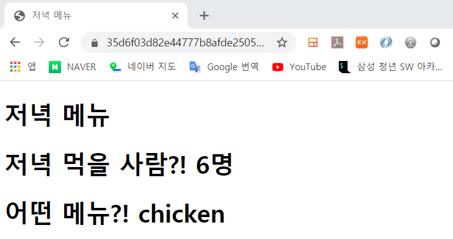

# 0327_workshop



1. intro/urls.py

   ```python
   from django.contrib import admin
   from django.urls import path
   from pages import views
   
   urlpatterns = [
       path('admin/', admin.site.urls),
       path('dinner/<str:menu>/<int:num>/', views.dinner),
   ]
   ```

2. pages/views.py

   ```python
   from django.shortcuts import render
   def dinner(request, menu, num):
       context = {
           'menu': menu,
           'number': num
       }
       return render(request, 'dinner.html', context)
   ```

3. templates/dinner.html

   ```html
   <!DOCTYPE html>
   <html lang="ko">
   <head>
       <meta charset="UTF-8">
       <meta name="viewport" content="width=device-width, initial-scale=1.0">
       <meta http-equiv="X-UA-Compatible" content="ie=edge">
       <title>저녁 메뉴</title>
   </head>
   <body>
       <h1>저녁 메뉴</h1>
       <h1>저녁 먹을 사람?! {{ number }}명</h1>
       <h1>어떤 메뉴?! {{ menu }}</h1>
   </body>
   </html>
   ```

