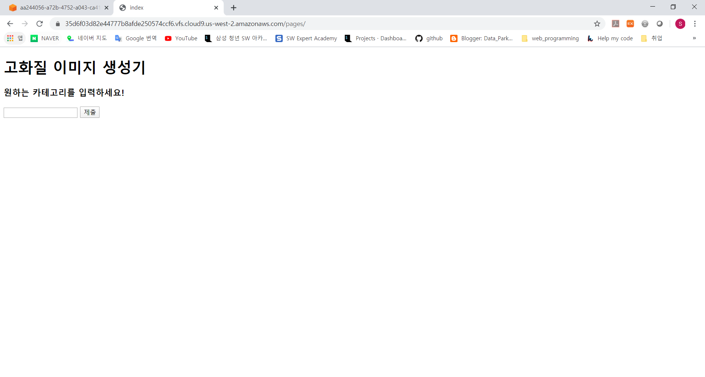
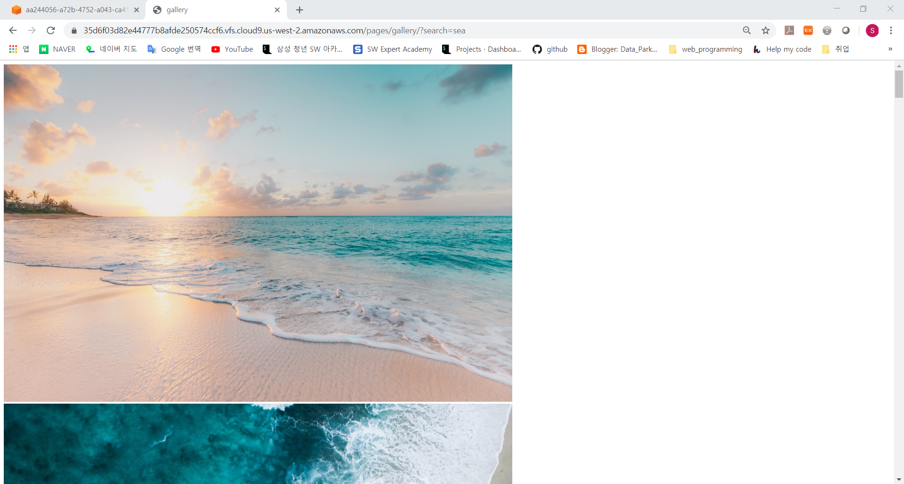
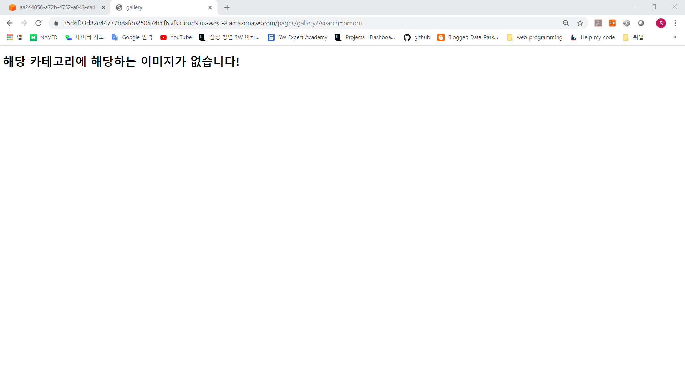

# 0330_workshop

## Problem 1

### 결과 사진

- 

### code

- views.py

  ```python
  from django.shortcuts import render
  import requests
  import json
  # Create your views here.
  
  def index(request):
      return render(request, 'index.html')
  
  def gallery(request):
      search = request.GET.get('search')
      base_url = "https://api.unsplash.com/search/photos?page=1&query="
      key= "vk5BWGMXrDORmmhk6btP3hXxfuBrlbQdqw037aSXi5c"
      final_url = "{}{}&client_id={}".format(base_url, search, key)
  
      response = requests.get(final_url).text
      data = json.loads(response)
      urls = []
      for result in data['results']:
          urls.append(result['urls']['regular'])
  
      context = {
          'search':search,
          'urls':urls,
      }
      return render(request, 'gallery.html', context)
  ```

- urls.py

  ```python
  from django.contrib import admin
  from django.urls import path
  from pages import views
  
  urlpatterns = [
      path('admin/', admin.site.urls),
      path('pages/', views.index),
      path('pages/gallery/', views.gallery),
  ]
  ```

- index.html

  ```html
  <!DOCTYPE html>
  <html lang="ko">
  <head>
      <meta charset="UTF-8">
      <meta name="viewport" content="width=device-width, initial-scale=1.0">
      <meta http-equiv="X-UA-Compatible" content="ie=edge">
      <title>index</title>
  </head>
  <body>
      <h1>고화질 이미지 생성기</h1>
      <h3>원하는 카테고리를 입력하세요!</h3>
      <form action="/pages/gallery" method="">
          <input type="text" name="search">
          <input type="submit">
      </form>
  </body>
  </html>
  ```

## Problem 2

### 결과 사진

- 
- 

### code

- views.py

  ```python
  import requests
  import json
  # Create your views here.
  
  def index(request):
      return render(request, 'index.html')
  
  def gallery(request):
      search = request.GET.get('search')
      base_url = "https://api.unsplash.com/search/photos?page=1&query="
      key= "vk5BWGMXrDORmmhk6btP3hXxfuBrlbQdqw037aSXi5c"
      final_url = "{}{}&client_id={}".format(base_url, search, key)
  
      response = requests.get(final_url).text
      data = json.loads(response)
      urls = []
      for result in data['results']:
          urls.append(result['urls']['regular'])
  
      context = {
          'search':search,
          'urls':urls,
      }
      return render(request, 'gallery.html', context)
  ```

- urls.py

  ```python
  from django.contrib import admin
  from django.urls import path
  from pages import views
  
  urlpatterns = [
      path('admin/', admin.site.urls),
      path('pages/', views.index),
      path('pages/gallery/', views.gallery),
  ]
  ```

- gallery.html

  ```html
  <!DOCTYPE html>
  <html lang="ko">
  <head>
      <meta charset="UTF-8">
      <meta name="viewport" content="width=device-width, initial-scale=1.0">
      <meta http-equiv="X-UA-Compatible" content="ie=edge">
      <title>gallery</title>
  </head>
  <body>
      
          
      
          <h1>해당 카테고리에 해당하는 이미지가 없습니다!</h1>
      
  </body>
  </html>
  ```