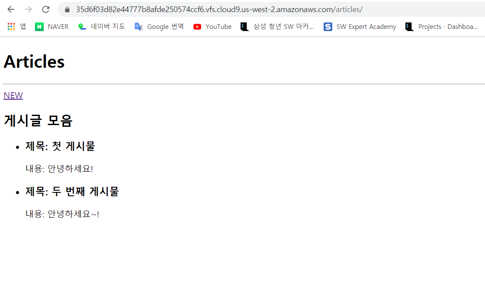
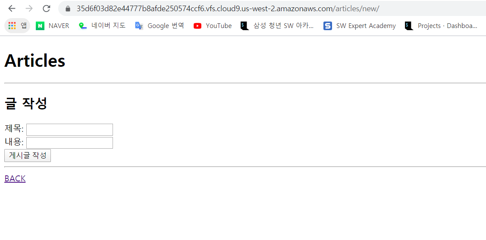
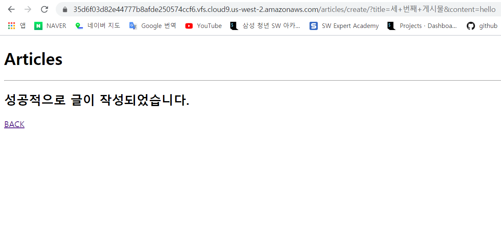
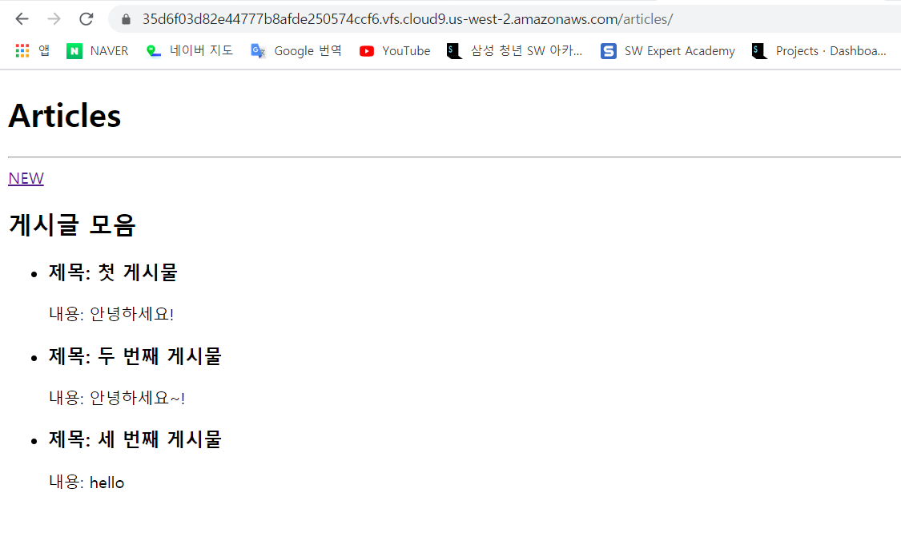

# 0331_workshop

## 결과 사진

- /articles/

  

- /articles/new/

  

- /articles/create/

  

- /articles/    (updated)

  

## Code

- crud/settings.py

  ```python
  """
  Django settings for crud project.
  
  Generated by 'django-admin startproject' using Django 2.1.15.
  
  For more information on this file, see
  https://docs.djangoproject.com/en/2.1/topics/settings/
  
  For the full list of settings and their values, see
  https://docs.djangoproject.com/en/2.1/ref/settings/
  """
  
  import os
  
  # Build paths inside the project like this: os.path.join(BASE_DIR, ...)
  BASE_DIR = os.path.dirname(os.path.dirname(os.path.abspath(__file__)))
  
  
  # Quick-start development settings - unsuitable for production
  # See https://docs.djangoproject.com/en/2.1/howto/deployment/checklist/
  
  # SECURITY WARNING: keep the secret key used in production secret!
  SECRET_KEY = 'b$m76@g@pn)2&c(^de=$)&6nwe1^9)vt-hnhr@wbsnk%t=uscj'
  
  # SECURITY WARNING: don't run with debug turned on in production!
  DEBUG = True
  
  ALLOWED_HOSTS = ['*']
  
  
  # Application definition
  
  INSTALLED_APPS = [
      'django_extensions',
      'articles',
      'django.contrib.admin',
      'django.contrib.auth',
      'django.contrib.contenttypes',
      'django.contrib.sessions',
      'django.contrib.messages',
      'django.contrib.staticfiles',
  ]
  
  MIDDLEWARE = [
      'django.middleware.security.SecurityMiddleware',
      'django.contrib.sessions.middleware.SessionMiddleware',
      'django.middleware.common.CommonMiddleware',
      'django.middleware.csrf.CsrfViewMiddleware',
      'django.contrib.auth.middleware.AuthenticationMiddleware',
      'django.contrib.messages.middleware.MessageMiddleware',
      'django.middleware.clickjacking.XFrameOptionsMiddleware',
  ]
  
  ROOT_URLCONF = 'crud.urls'
  
  TEMPLATES = [
      {
          'BACKEND': 'django.template.backends.django.DjangoTemplates',
          'DIRS': [os.path.join(BASE_DIR, 'crud', 'templates')],
          'APP_DIRS': True,
          'OPTIONS': {
              'context_processors': [
                  'django.template.context_processors.debug',
                  'django.template.context_processors.request',
                  'django.contrib.auth.context_processors.auth',
                  'django.contrib.messages.context_processors.messages',
              ],
          },
      },
  ]
  
  WSGI_APPLICATION = 'crud.wsgi.application'
  
  
  # Database
  # https://docs.djangoproject.com/en/2.1/ref/settings/#databases
  
  DATABASES = {
      'default': {
          'ENGINE': 'django.db.backends.sqlite3',
          'NAME': os.path.join(BASE_DIR, 'db.sqlite3'),
      }
  }
  
  
  # Password validation
  # https://docs.djangoproject.com/en/2.1/ref/settings/#auth-password-validators
  
  AUTH_PASSWORD_VALIDATORS = [
      {
          'NAME': 'django.contrib.auth.password_validation.UserAttributeSimilarityValidator',
      },
      {
          'NAME': 'django.contrib.auth.password_validation.MinimumLengthValidator',
      },
      {
          'NAME': 'django.contrib.auth.password_validation.CommonPasswordValidator',
      },
      {
          'NAME': 'django.contrib.auth.password_validation.NumericPasswordValidator',
      },
  ]
  
  
  # Internationalization
  # https://docs.djangoproject.com/en/2.1/topics/i18n/
  
  LANGUAGE_CODE = 'ko-kr'
  
  TIME_ZONE = 'Asia/Seoul'
  
  USE_I18N = True
  
  USE_L10N = True
  
  USE_TZ = True
  
  
  # Static files (CSS, JavaScript, Images)
  # https://docs.djangoproject.com/en/2.1/howto/static-files/
  
  STATIC_URL = '/static/'
  ```

- crud/urls.py

  ```python
  from django.contrib import admin
  from django.urls import path, include
  
  urlpatterns = [
      path('admin/', admin.site.urls),
      path('articles/', include('articles.urls')),
  ]
  ```

- articles/urls.py

  ```python
  from django.urls import path
  from . import views
  
  urlpatterns = [
      path('', views.index),
      path('new/', views.new),
      path('create/', views.create),
  ]
  ```

- articles/views.py

  ```python
  from django.shortcuts import render
  from .models import Article
  
  # Create your views here.
  def index(request):
      articles = Article.objects.all()
      context = {
          "articles":articles,
      }
      print(articles)
      return render(request, 'articles/index.html', context)
  
  def new(request):
      return render(request, 'articles/new.html')
  
  def create(request):
      article = Article()
      article.title = request.GET.get("title")
      article.content = request.GET.get("content")
      article.save()
      return render(request, 'articles/create.html')
  ```

- crud/templates/base.html

  ```html
  <!DOCTYPE html>
  <html lang="ko">
  <head>
      <meta charset="UTF-8">
      <meta name="viewport" content="width=device-width, initial-scale=1.0">
      <meta http-equiv="X-UA-Compatible" content="ie=edge">
      <title>crud</title>
  </head>
  <body>
      <h1>Articles</h1>
      <hr>
      
      
  </body>
  </html>
  ```

- templates/articles/index.html

  ```html
  
  
  
  <a href="/articles/new/">NEW</a>
  <h2>게시글 모음</h2>
  
      <ul>
          <li>
              <h3>제목: {{ article.title }}</h3>
              <p>내용: {{ article.content }}</p>
          </li>
      </ul>
  
      <p>게시물이 없습니다.</p>
  
  
  ```

- templates/articles/new.html

  ```html
  
  
  
  <h2>글 작성</h2>
  <form action="/articles/create/" method="GET">
      <label for "title">제목: </label>
      <input type="text" id="title" name="title"> <br>
      <label for "content">내용: </label>
      <input type="text" id="content" name="content"> <br>
      <input type="submit" value="게시글 작성">
  </form>
  <hr>
  <a href="/articles/">BACK</a>
  
  ```

- templates/articles/create.html

  ```html
  
  
  
  <h2>성공적으로 글이 작성되었습니다.</h2>
  <a href="/articles/">BACK</a>
  
  ```