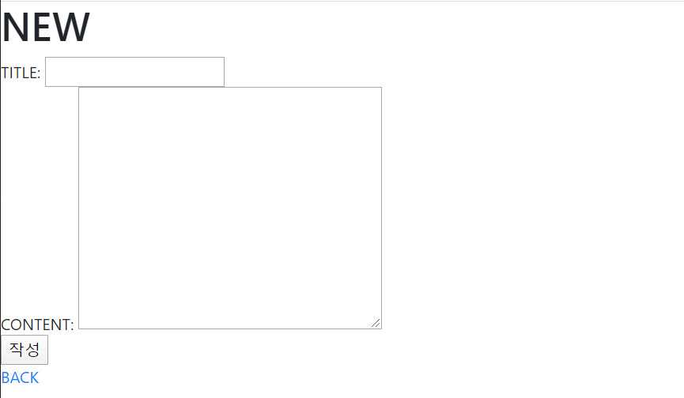
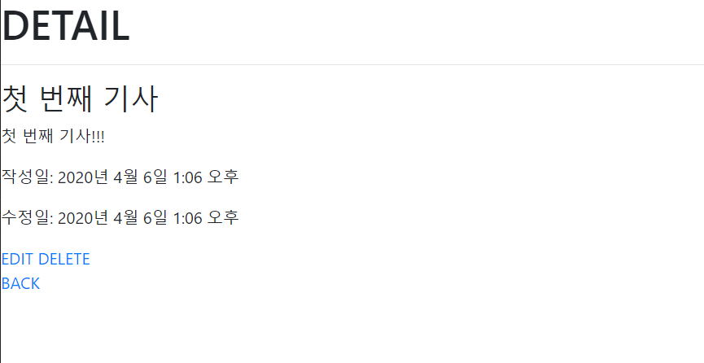
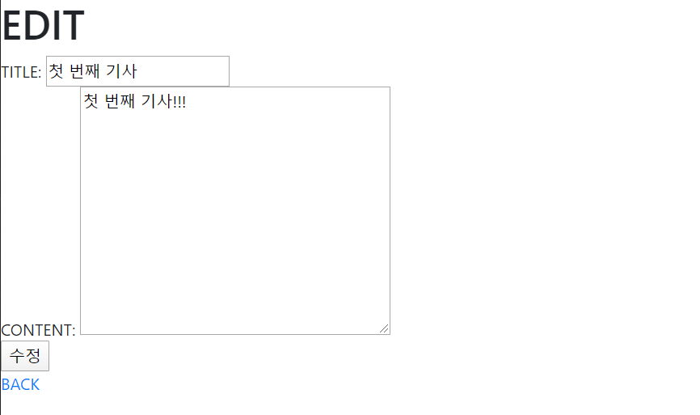

# 0406_exercise

## 결과 사진

- Read

  

- Create

  

- Detail

  

- Update

  

- Delete(첫 글 삭제)

  

## Code

- crud/setting.py

  ```python
  import os
  
  # Build paths inside the project like this: os.path.join(BASE_DIR, ...)
  BASE_DIR = os.path.dirname(os.path.dirname(os.path.abspath(__file__)))
  
  
  # Quick-start development settings - unsuitable for production
  # See https://docs.djangoproject.com/en/2.1/howto/deployment/checklist/
  
  # SECURITY WARNING: keep the secret key used in production secret!
  SECRET_KEY = 'p02&=tky^1x233rnx4l3u*wr2rzy*bq#+5cjd8a25goh(^nc-@'
  
  # SECURITY WARNING: don't run with debug turned on in production!
  DEBUG = True
  
  ALLOWED_HOSTS = ['*']
  
  
  # Application definition
  
  INSTALLED_APPS = [
      'articles',
      'django.contrib.admin',
      'django.contrib.auth',
      'django.contrib.contenttypes',
      'django.contrib.sessions',
      'django.contrib.messages',
      'django.contrib.staticfiles',
  ]
  
  MIDDLEWARE = [
      'django.middleware.security.SecurityMiddleware',
      'django.contrib.sessions.middleware.SessionMiddleware',
      'django.middleware.common.CommonMiddleware',
      'django.middleware.csrf.CsrfViewMiddleware',
      'django.contrib.auth.middleware.AuthenticationMiddleware',
      'django.contrib.messages.middleware.MessageMiddleware',
      'django.middleware.clickjacking.XFrameOptionsMiddleware',
  ]
  
  ROOT_URLCONF = 'crud.urls'
  
  TEMPLATES = [
      {
          'BACKEND': 'django.template.backends.django.DjangoTemplates',
          'DIRS': [os.path.join(BASE_DIR, 'templates')],
          'APP_DIRS': True,
          'OPTIONS': {
              'context_processors': [
                  'django.template.context_processors.debug',
                  'django.template.context_processors.request',
                  'django.contrib.auth.context_processors.auth',
                  'django.contrib.messages.context_processors.messages',
              ],
          },
      },
  ]
  
  WSGI_APPLICATION = 'crud.wsgi.application'
  
  
  # Database
  # https://docs.djangoproject.com/en/2.1/ref/settings/#databases
  
  DATABASES = {
      'default': {
          'ENGINE': 'django.db.backends.sqlite3',
          'NAME': os.path.join(BASE_DIR, 'db.sqlite3'),
      }
  }
  
  
  # Password validation
  # https://docs.djangoproject.com/en/2.1/ref/settings/#auth-password-validators
  
  AUTH_PASSWORD_VALIDATORS = [
      {
          'NAME': 'django.contrib.auth.password_validation.UserAttributeSimilarityValidator',
      },
      {
          'NAME': 'django.contrib.auth.password_validation.MinimumLengthValidator',
      },
      {
          'NAME': 'django.contrib.auth.password_validation.CommonPasswordValidator',
      },
      {
          'NAME': 'django.contrib.auth.password_validation.NumericPasswordValidator',
      },
  ]
  
  
  # Internationalization
  # https://docs.djangoproject.com/en/2.1/topics/i18n/
  
  LANGUAGE_CODE = 'ko-kr'
  
  TIME_ZONE = 'Asia/Seoul'
  
  USE_I18N = True
  
  USE_L10N = True
  
  USE_TZ = True
  
  
  # Static files (CSS, JavaScript, Images)
  # https://docs.djangoproject.com/en/2.1/howto/static-files/
  
  STATIC_URL = '/static/'
  ```

- crud/urls.py

  ```python
  from django.contrib import admin
  from django.urls import path, include
  
  urlpatterns = [
      path('admin/', admin.site.urls),
      path('articles/', include('articles.urls')),
  ]
  ```

- template/base.html

  ```html
  <!doctype html>
  <html lang="ko">
    <head>
      <!-- Required meta tags -->
      <meta charset="utf-8">
      <meta name="viewport" content="width=device-width, initial-scale=1, shrink-to-fit=no">
  
      <!-- Bootstrap CSS -->
      <link rel="stylesheet" href="https://stackpath.bootstrapcdn.com/bootstrap/4.4.1/css/bootstrap.min.css" integrity="sha384-Vkoo8x4CGsO3+Hhxv8T/Q5PaXtkKtu6ug5TOeNV6gBiFeWPGFN9MuhOf23Q9Ifjh" crossorigin="anonymous">
  
      <title>0406_exercise</title>
    </head>
    <body>
      
      
      <!-- Optional JavaScript -->
      <!-- jQuery first, then Popper.js, then Bootstrap JS -->
      <script src="https://code.jquery.com/jquery-3.4.1.slim.min.js" integrity="sha384-J6qa4849blE2+poT4WnyKhv5vZF5SrPo0iEjwBvKU7imGFAV0wwj1yYfoRSJoZ+n" crossorigin="anonymous"></script>
      <script src="https://cdn.jsdelivr.net/npm/popper.js@1.16.0/dist/umd/popper.min.js" integrity="sha384-Q6E9RHvbIyZFJoft+2mJbHaEWldlvI9IOYy5n3zV9zzTtmI3UksdQRVvoxMfooAo" crossorigin="anonymous"></script>
      <script src="https://stackpath.bootstrapcdn.com/bootstrap/4.4.1/js/bootstrap.min.js" integrity="sha384-wfSDF2E50Y2D1uUdj0O3uMBJnjuUD4Ih7YwaYd1iqfktj0Uod8GCExl3Og8ifwB6" crossorigin="anonymous"></script>
    </body>
  </html>
  ```

- articles/models.py

  ```python
  from django.db import models
  
  # Create your models here.
  class Article(models.Model):
      title = models.CharField(max_length=140)
      content = models.TextField()
      created_at = models.DateTimeField(auto_now_add=True)
      updated_at = models.DateTimeField(auto_now=True)
  ```

- articles/admin.py

  ```python
  from django.contrib import admin
  
  # Register your models here.
  from .models import Article
  
  admin.site.register(Article)
  ```

- articles/urls.py

  ```python
  from django.urls import path
  from . import views
  
  urlpatterns = [
      path('', views.index),
      path('new/', views.new),
      path('create/', views.create),
      path('<int:pk>/', views.detail),
      path('<int:pk>/edit/', views.edit),
      path('<int:pk>/update/', views.update),
      path('<int:pk>/delete/', views.delete),
  ]
  ```

- articles/view.py

  ```python
  from django.shortcuts import render, redirect
  from .models import Article
  
  # Create your views here.
  def index(request):
      articles = Article.objects.all()
      context = {
          'articles': articles
      }
      return render(request, 'articles/index.html', context)
  
  def new(request):
      return render(request, 'articles/new.html')
  
  def create(request):
      article = Article()
      article.title = request.POST.get('title')
      article.content = request.POST.get('content')
      article.save()
      return redirect(f'/articles/{article.pk}/')
  
  def detail(request, pk):
      article = Article.objects.get(id=pk)
      context = {
          'article':article,
      }
      return render(request, 'articles/detail.html', context)
  
  def edit(request, pk):
      article = Article.objects.get(id=pk)
      context = {
          'article':article,
      }
      return render(request, 'articles/edit.html', context)
  
  def update(request, pk):
      article = Article.objects.get(id=pk)
      article.title = request.POST.get('title')
      article.content = request.POST.get('content')
      article.save()
      return redirect(f'/articles/{article.pk}/')
  
  def delete(request, pk):
      article = Article.objects.get(id=pk)
      article.delete()
      return redirect('/articles/')
  ```

- articles/templates/articles/index.html

  ```html
  
  
  
  <h1>INDEX</h1>
  <a href="/articles/new/">NEW</a>
  
      <h3>제목: {{ article.title }}</h3>
      <p>내용: {{ article.content }}</p>
      <a href="/articles/{{ article.pk }}/">DETAIL</a>
      <hr>
  
      <p>게시물이 없습니다.</p>
  
  
  ```

- articles/templates/articles/new.html

  ```html
  
  
  
  <h1>NEW</h1>
  <form action="/articles/create/" method="POST">
      
      TITLE: <input type="text" name="title">
      <br>
      CONTENT: <textarea cols='40' rows='10' name="content"></textarea>
      <br>
      <input type="submit" value="작성">
  </form>
  <a href="/articles/">BACK</a>
  
  ```

- articles/templates/articles/detail.html

  ```html
  
  
  
      <h1>DETAIL</h1>
      <hr>
      <h3>{{ article.title }}</h3>
      <p>{{ article.content }}</p>
      <p>작성일: {{ article.created_at }}</p>
      <p>수정일: {{ article.updated_at }}</p>
      <a href="/articles/{{ article.pk }}/edit/">EDIT</a>
      <a href="/articles/{{ article.pk }}/delete/">DELETE</a>
      <br>
      <a href="/articles/">BACK</a>
  
  ```

- articles/templates/articles/edit.html

  ```html
  
  
  
  <h1>EDIT</h1>
  <form action="/articles/{{ article.pk }}/update/" method="POST">
      
      TITLE: <input type="text" name="title" value="{{ article.title }}">
      <br>
      CONTENT: <textarea cols='40' rows='10' name="content">{{ article.content }}</textarea>
      <br>
      <input type="submit" value="수정">
  </form>
  <a href="/articles/{{ article.pk }}/">BACK</a>
  
  ```