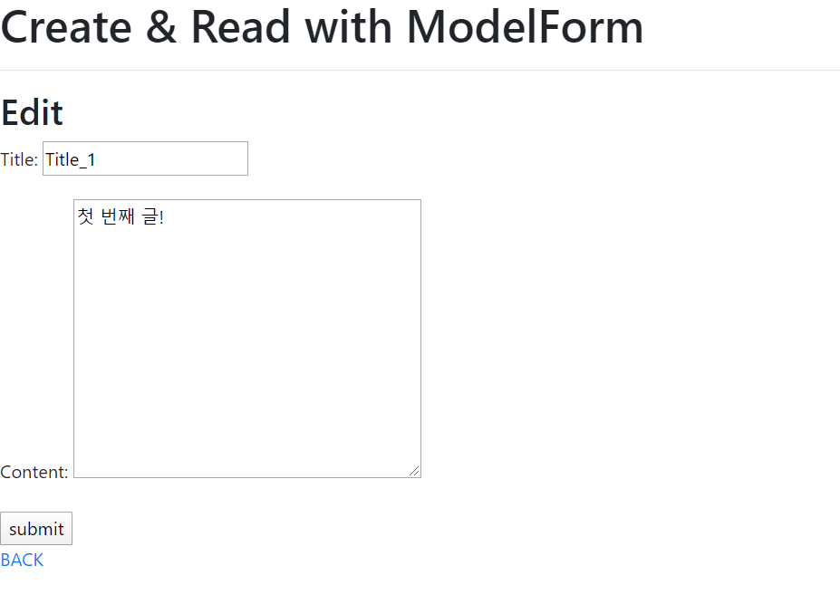

# 0407_workshop

## 결과 사진

- update

  

## Code

- views.py

  ```python
  from django.shortcuts import render, redirect, get_object_or_404
  from .models import Article
  from .forms import ArticleForm
  
  # Create your views here.
  def index(request):
      articles = Article.objects.order_by('pk')
      context = {
          'articles':articles,
      }
      return render(request, 'articles/index.html', context)
  
  def create(request):
      if request.method == 'POST':
          form = ArticleForm(request.POST)
  
          if form.is_valid():
              article = form.save()
              return redirect('articles:index')
      else:
          form = ArticleForm()
  
      context = {
          'form':form,
      }
      return render(request, 'articles/create.html', context)
  
  def detail(request, pk):
      article = get_object_or_404(Article, pk=pk)
      context = {
          'article':article,
      }
      return render(request, 'articles/detail.html', context)
  
  def update(request, pk):
      article = get_object_or_404(Article, pk=pk)
  
      if request.method == 'POST':
          form = ArticleForm(request.POST, instance=article)
          if form.is_valid():
              article = form.save()
              return redirect('articles:detail', article.pk)
      else:
          form = ArticleForm(instance=article)
  
      context = {
          'article':article,
          'form':form,
      }
      return render(request, 'articles/update.html', context)
  
  def delete(request, pk):
      article = get_object_or_404(Article, pk=pk)
      article.delete()
      return redirect('articles:index')
  ```

- forms.py

  ```python
  from django import forms
  from .models import Article
  
  class ArticleForm(forms.ModelForm):
      class Meta:
          model = Article
          fields = ['title', 'content']
  ```