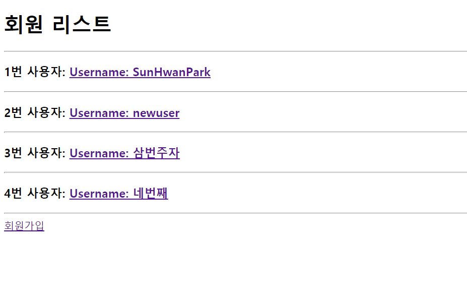
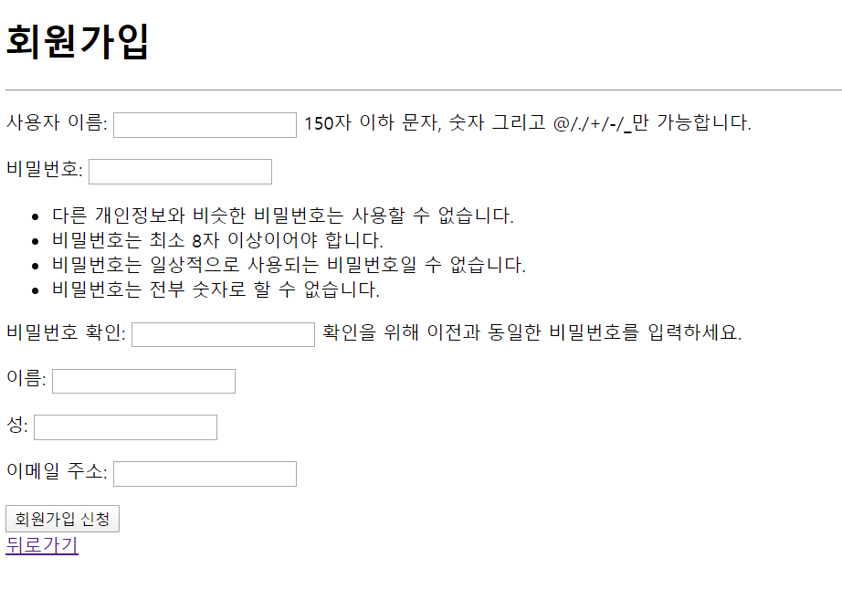
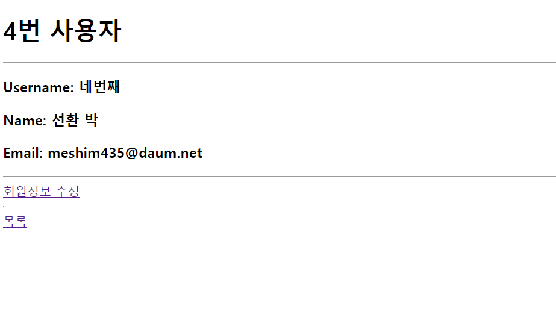
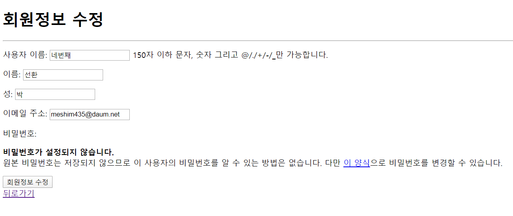

# 0413_workshop

## 결과사진

- /accounts/

  

- /accounts/signup/

  

- /accounts/`<int:pk>`/

  

- /accounts/`<int:pk>`/update/

  

## Code

- views.py

  ```python
  from django.shortcuts import render, redirect, get_object_or_404
  from django.contrib.auth import get_user_model
  # from django.contrib.auth.forms import UserCreationForm, UserChangeForm
  from .forms import CustomUserCreationForm, CustomUserChangeForm
  
  # Create your views here.
  def index(request):
      User = get_user_model()
      users = User.objects.all()
      context = {
          'users':users,
      }
      return render(request, 'accounts/index.html', context)
  
  def signup(request):
      if request.method == 'POST':
          form = CustomUserCreationForm(request.POST)
          if form.is_valid():
              form.save()
              return redirect('accounts:index')
      else:
          form = CustomUserCreationForm()
      context = {
          'form':form,
      }
      return render(request, 'accounts/signup.html', context)
  
  def detail(request, pk):
      User = get_user_model()
      user = get_object_or_404(User, pk=pk)
      context = {
          'user':user,
      }
      return render(request, 'accounts/detail.html', context)
  
  def update(request, pk):
      User = get_user_model()
      user = get_object_or_404(User, pk=pk)
      if request.method == 'POST':
          form = CustomUserChangeForm(request.POST, instance=user)
          if form.is_valid():
              form.save()
              return redirect('accounts:detail', pk)
      else:
          form = CustomUserChangeForm(instance=user)
  
      context = {
          'form':form,
          'user':user,
      }
      return render(request, 'accounts/update.html', context)
  ```

- forms.py

  ```python
  from django.contrib.auth import get_user_model
  from django.contrib.auth.forms import UserCreationForm, UserChangeForm
  
  class CustomUserCreationForm(UserCreationForm):
      class Meta:
          model = get_user_model()
          fields = ['username', 'password1', 'password2', 'first_name', 'last_name', 'email']
  
  class CustomUserChangeForm(UserChangeForm):
      class Meta:
          model = get_user_model()
          fields = ['username', 'first_name', 'last_name', 'email']
  ```