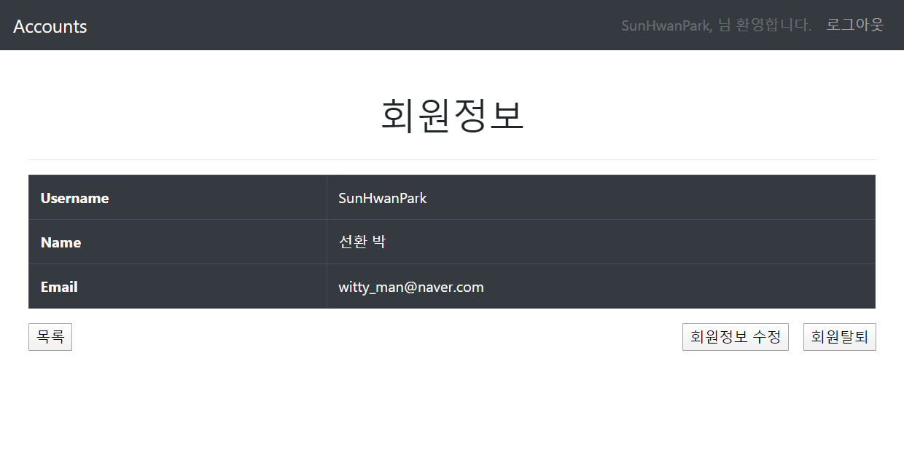

# 0414_workshop

## 결과사진

- index(logout 상태)

  /accounts/

  

- index(login 상태)

  /accounts/

  

- login

  /accounts/login/

  

- signup

  /accounts/signup/

  

- detail(self)

  /accounts/`<int:pk>`/

  

- detail(other)

  /accounts/`<int:pk>`/
  
  
  
- update

  /accounts/`<int:pk>`/update/
  
  

## Code

- views.py

  ```python
  from django.shortcuts import render, redirect, get_object_or_404
  from django.contrib.auth import get_user_model
  from django.contrib.auth import login as auth_login
  from django.contrib.auth import logout as auth_logout
  from django.contrib.auth.forms import UserCreationForm, UserChangeForm, AuthenticationForm
  from django.contrib.auth.decorators import login_required
  from django.views.decorators.http import require_POST
  from .forms import CustomUserCreationForm, CustomUserChangeForm
  # Create your views here.
  
  def index(request):
      User = get_user_model()
      users = User.objects.all()
      context = {
          'users':users,
      }
      return render(request, 'accounts/index.html', context)
  
  def signup(request):
      if request.user.is_authenticated:
          return redirect('accounts:index')
  
      if request.method == 'POST':
          form = CustomUserCreationForm(request.POST)
          if form.is_valid():
              form.save()
              return redirect('accounts:index')
      else:
          form = CustomUserCreationForm()
      context = {
          'form':form,
      }
      return render(request, 'accounts/signup.html', context)
  
  @login_required
  def detail(request, pk):
      # if not request.user.is_authenticated:
      #     return redirect('accounts:index')
      User = get_user_model()
      user = get_object_or_404(User, pk=pk)
      context = {
          'user':user,
      }
      return render(request, 'accounts/detail.html', context)
  
  @login_required
  def update(request, pk):
      # if not request.user.is_authenticated:
      #     return redirect('accounts:index')
      User = get_user_model()
      user = get_object_or_404(User, pk=pk)
      if request.method == 'POST':
          form = CustomUserChangeForm(request.POST, instance=user)
          if form.is_valid():
              form.save()
              return redirect('accounts:detail', pk)
      else:
          form = CustomUserChangeForm(instance=user)
      context = {
          'form':form,
          'user':user,
      }
      return render(request, 'accounts/update.html', context)
  
  def login(request):
      if request.user.is_authenticated:
          return redirect('accounts:index')
  
      if request.method == 'POST':
          form = AuthenticationForm(request, request.POST)
          if form.is_valid():
              auth_login(request, form.get_user())
              # 단축평가
              return redirect(request.GET.get('next') or 'accounts:index')
      else:
          form = AuthenticationForm()
      context = {
          'form':form,
      }
      return render(request, 'accounts/login.html', context)
  
  @login_required
  def logout(request):
      auth_logout(request)
      return redirect('accounts:index')
  
  @login_required
  @require_POST
  def delete(request):
      request.user.delete()
      return redirect('accounts:index')
  ```
