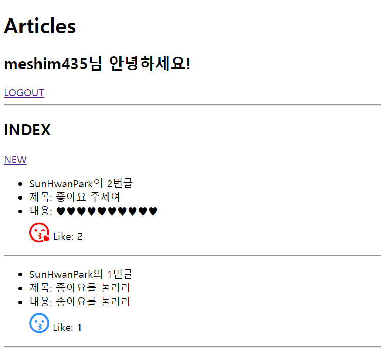

# 0428_exercise

## 결과 사진



## Code

- `views.py`

  ```python
  from django.shortcuts import render, redirect, get_object_or_404
  from .models import Article
  from .forms import ArticleForm
  from django.contrib.auth.decorators import login_required
  
  def index(request):
      articles = Article.objects.order_by('-pk')
      context = {
          'articles': articles,
      }
      return render(request, 'articles/index.html', context)
  
  @login_required
  def create(request):
      if request.method == 'POST':
          form = ArticleForm(request.POST)
          if form.is_valid():
              article = form.save(commit=False)
              article.user = request.user
              article.save()
              return redirect('articles:index')
      else:
          form = ArticleForm()
      context = {
          'form': form,
      }
      return render(request, 'articles/form.html', context)
  
  @login_required
  def like(request, article_pk):
      article = get_object_or_404(Article, pk=article_pk)
      user = request.user
  
      # if article.like_users.filter(id=request.user.id).exists():
      if request.user in article.like_users.all():
          article.like_users.remove(user)
      else:
          article.like_users.add(user)
  
      return redirect('articles:index')
  ```

- `models.py`

  ```python
  from django.db import models
  from django.conf import settings
  
  class Article(models.Model):
      title = models.CharField(max_length=100)
      content = models.TextField()
      created_at = models.DateTimeField(auto_now_add=True)
      created_at = models.DateTimeField(auto_now=True)
      user = models.ForeignKey(settings.AUTH_USER_MODEL, on_delete=models.CASCADE)
      like_users = models.ManyToManyField(settings.AUTH_USER_MODEL, related_name='like_articles')
  ```

- `index.html`

  ```html
  
  
  
    <h2>INDEX</h2>
    <a href="">NEW</a>
    
      <ul>
        <li>{{ article.user }}의 {{ article.pk }}번글</li>
        <li>제목: {{ article.title }}</li>
        <li>내용: {{ article.content }}</li>
        
      </ul>
      <hr>
    
  
  ```

- `like.html`

  ```html
  
  <a href="" style="font-size: 2em; color: red;"><i class="far fa-kiss-wink-heart"></i></a>
  
  <a href="" style="font-size: 2em; color: Dodgerblue;"><i class="far fa-kiss"></i></a>
  
  Like: {{ article.like_users.count }}
  ```

  