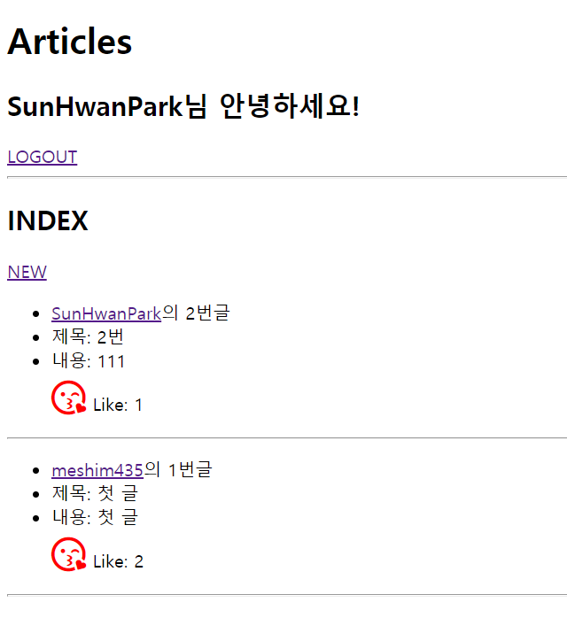
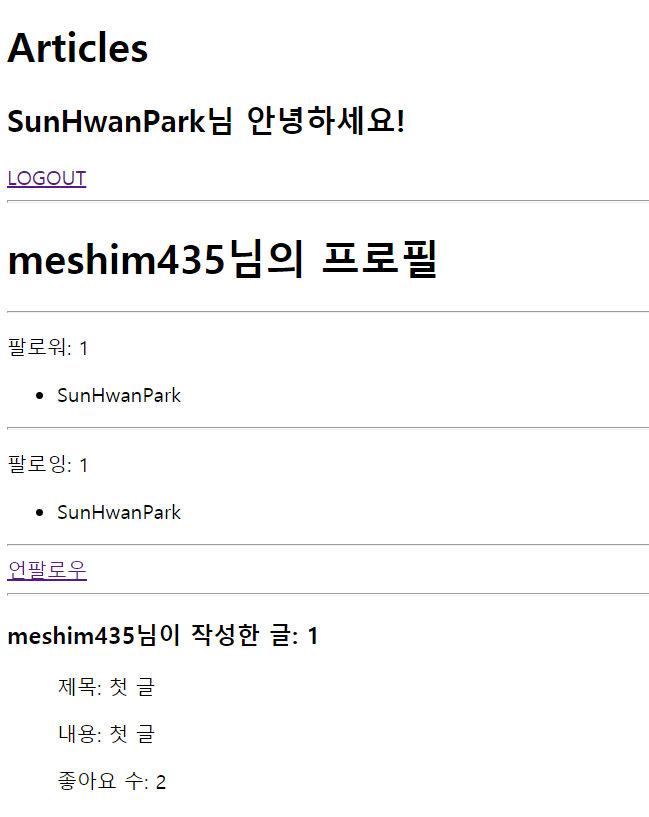

# 0428_workshop

## 결과 사진

- /articles/

  - 유저 이름을 클릭하면 해당 유저 프로필 페이지로 이동

  

- /meshim435/ (유저 프로필 페이지)

  

## Code

- accounts/views.py

  ```python
  from django.shortcuts import render, redirect, get_object_or_404
  from django.contrib.auth.forms import AuthenticationForm
  from .forms import CustomUserCreationForm
  from django.contrib.auth.decorators import login_required
  from django.contrib.auth import login as auth_login, logout as auth_logout
  from django.contrib.auth import get_user_model
  
  User = get_user_model()
  
  
  def signup(request):
      if request.method == 'POST':
          form = CustomUserCreationForm(request.POST)
          if form.is_valid():
              user = form.save()
              auth_login(request, user)
              return redirect('articles:index')
      else:
          form = CustomUserCreationForm()
      context = {
          'form': form,
      }
      return render(request, 'accounts/signup.html', context)
  
  def login(request):
      if request.method == 'POST':
          form = AuthenticationForm(request, request.POST)
          if form.is_valid():
              auth_login(request, form.get_user())
              return redirect('articles:index')
      else:
          form = AuthenticationForm()
      context = {
          'form': form,
      }
      return render(request, 'accounts/login.html', context)
  
  @login_required
  def logout(request):
      auth_logout(request)
      return redirect('articles:index')
  
  @login_required
  def follow(request, username):
      person = get_object_or_404(User, username=username)
      user = request.user
      if user != person:
          if user in person.followers.all():
              person.followers.remove(user)
          else:
              person.followers.add(user)
      # else:
      #     message.info('스스로는 팔로우 하실 수 없습니다.')
      return redirect('profile', person.username)
  
  @login_required
  def profile(request, username):
      person = get_object_or_404(User, username=username)
      context = {
          'person': person,
      }
      return render(request, 'accounts/profile.html', context)
  ```

- accounts/models.py

  ```python
  from django.db import models
  from django.contrib.auth.models import AbstractUser
  from django.conf import settings
  
  class User(AbstractUser):
      followers = models.ManyToManyField(settings.AUTH_USER_MODEL, related_name="followings")
  ```

- accounts/templates/accounts/profile.html

  ```html
  
  
  
  <h1>{{ person.username }}님의 프로필</h1>
  <hr>
  <p>팔로워: {{ person.followers.count }}</p>
  <ul>
      
      <li>{{ follower.username }}</li>
      
  </ul>
  <hr>
  <p>팔로잉: {{ person.followings.count }}</p>
  <ul>
      
      <li>{{ following.username }}</li>
      
  </ul>
  <hr>
  
  
  
      <a href="">언팔로우</a>
  
      <a href="">팔로우</a>
  
  
  <hr>
  <h3>{{ person.username }}님이 작성한 글: {{ person.article_set.all.count }}</h3>
  <ul>
  
      <p>제목: {{ article.title }}</p>
      <p>내용: {{ article.content }}</p>
      <p>좋아요 수: {{ article.like_users.count }}</p>
  
  </ul>
  
  
  ```