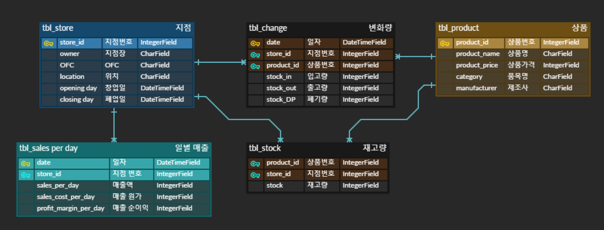

# 0504_workshop

- ERD

  

- `models.py`

  ```python
  from django.db import models
  
  class tbl_Product(models.Model):
      product_id = models.IntegerField(primary_key=True)
      product_name = models.CharField(max_length=20)
      product_price = models.IntegerField(default=0)
      category = models.CharField(max_length=20)
      manufacturer = models.CharField(max_length=20)
  
  class tbl_Store(models.Model):
      store_id = models.IntegerField(primary_key=True)
      owner = models.CharField(max_length=20)
      ofc = models.CharField(max_length=20)
      location = models.CharField(max_lenght=20)
      opening_day = models.DateTimeField(auto_now_add=True)
      closing_day = models.DateTimeField()
      products = models.ManyToManyField(tbl_Product, through="tbl_Change", related_name="stores")
  
  class tbl_Stock(models.Model):
      store = models.ForeignKey(tbl_Store, on_delete=models.PROTECT)
      product = models.ForeignKey(tbl_Product, on_delete=models.PROTECT)
      stock = models.IntegerField(default=0)
  
  class tbl_Change(models.Model):
      date = models.DateTimeField()
      store = models.ForeignKey(tbl_Store, on_delete=models.PROTECT)
      product = models.ForeignKey(tbl_Product, on_delete=models.PROTECT)
      stock_in = models.IntegerField(default=0)
      stock_out = models.IntegerField(default=0)
      stock_DP = models.IntegerField(default=0)
  
      class Meta:
          unique_together = (('date', 'store', 'product'),)
  
  class tbl_Sales_per_day(models.Model):
      date = models.DateTimeField()
      store = models.ForeignKey(tbl_Store, on_delete=models.CASCADE)
      sales_per_day = models.IntegerField()
      sales_cost_per_day = models.IntegerField()
      profit_margin_per_day = models.IntegerField()
  
      class Meta:
          unique_together = (('date', 'store'),)
  ```

