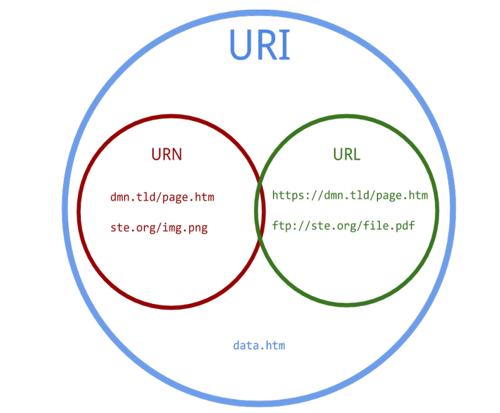

# 0511_homework

## URI vs URL vs URN



### URI(Uniform Resource Identifier)

- 통합 자원 식별자

- 인터넷에 있는 자원을 고유하게 식별하고 위치를 지정할 수 있는 유일한 주소이다.

- URI의 존재는 인터넷에서 요구되는 기본조건으로서, 인터넷 프로토콜에 항상 붙어다닌다.
  \- ex) [http://www.naver.com](http://www.naver.com/) (http프로토콜임을 명시하고 있음)

- URI의 하위개념에 URL, URN이 포함되어 있다.

- URI의 보편적인 형태가 URL인데, URI의 부분집합으로 볼 수 있다.

  \- 자원에 접근하기 위해 사용되는 절차

  - 어떤 자원을 가지고 있는 특정한 컴퓨터
  - 컴퓨터 상의 유니크한 자원의 이름(파일명)

- http://test.com/test.pdf?docid=111이라는 주소는 URI이지만 URL은 아니다.

  \- http://test.com/test.pdf까지만 URL(주소의 위치)

  - docid=111이라는 쿼리스트링의 값에 따라 결과가 달라지게됨, 따라서 식별자 역할을 하고 있다.

- http://test.com/test.pdf?docid=111 ,http://test.com/test.pdf?docid=112는 같은 URL을 가지고 다른 URI를 가진다.

### URL(Uniform Resource Locator)

- 통합 자원 지시자
- 웹 상에 서비스를 제공하는 각 서버들에 있는 파일의 위치를 표시한다.
  \- http://blong.com/work/test.pdf 는 blog.com서버에서 work폴더안의 test.pdf를 요청

### URN(Uniform Resource Name)

- 한 자원에 대해, 그 자원의 위치에 영향을 받지 않는 유일무이한 이름
- URN은 자원 위치에 독립적이라, 자원을 여기저기로 옮기더라도 문제없이 동작한다.

---

1. 아래의 설명을 읽고 T/F 여부를 작성하시오.

   - URI는 정보의 자원 뿐만 아니라 HTTP Method를 통해 무엇을 어떻게 하고 싶은지 명확하게 나타내야 한다.

     > False, URI는 자원을 표현하는 데 집중해야한다.

   - 자원에 대한 행위는 HTTP Method로 표현한다.

     > True

   - 일반적으로 주소 마지막에 슬래시 ( / )는 포함하지 않는다.

     > True, REST API는 분명한 URI를 만들어 통신을 해야 하기 때문에 혼동을 주지 않도록 URI 경로의 마지막에는 슬래시(/)를 사용하지 않는다. 단, django는 마지막 슬래시를 포함하는 것이 특징.

   - https ://www.fifa.com/worldcup/teams/team/43822/create는 계층 관계를 잘 표현한 RESTful한 URI 라고 할 수 있다.

     > False, URI 주소 안에 자원에 대한 행위를 표현하는 'create'가 있어 RESTful 하지 않다.

2. 다음의 HTTP status code 의 의미를 간략하게 작성하시오.

   - 200

     > 클라이언트의 요청을 정상적으로 수행함

   - 400

     >  클라이언트의 요청이 부적절 할 경우 사용하는 응답 코드

   - 401

     > 클라이언트가 인증되지 않은 상태에서 보호된 리소스를 요청했을 때 사용하는 응답 코드

   - 403

     > 유저 인증상태와 관계 없이 응답하고 싶지 않은 리소스를 클라이언트가 요청했을 때 사용하는 응답 코드

   - 404

     > 클라이언트가 서버에서 찾을 수 없는 리소스를 요청했을 때 사용하는 응답 코드

   - 500

     > 서버에 문제가 있을 경우 사용하는 응답 코드

3. DRF 를 활용하여 학생 정보를 제공하는 API 를 제작하고자 한다. 학생 모델은 models.py에 아래와 같이 정의되어 있고, 학생 모델의 데이터를 다른 유형의 데이터 포맷으로 변환할 수 있는 Serializer를 정의하려고 한다. Serializers.py 파일에 들어갈 StudentSerializer를 정의하시오. 단 , name과 address 필드는 반드시 포함되어야 한다.

   ```python
   class Student(models.Model):
       name = models.TextField()
       age = models.CharField(max_length=20)
       address = models.TextField()
   ```

   > ```python
   > # serializers.py
   > from rest_framework import serializers
   > from .models import Student
   > 
   > class StudentSerializer(serializers.ModelSerializer):
   >     class Meta:
   >         model = Student
   >         fields = ['name', 'address']
   > ```