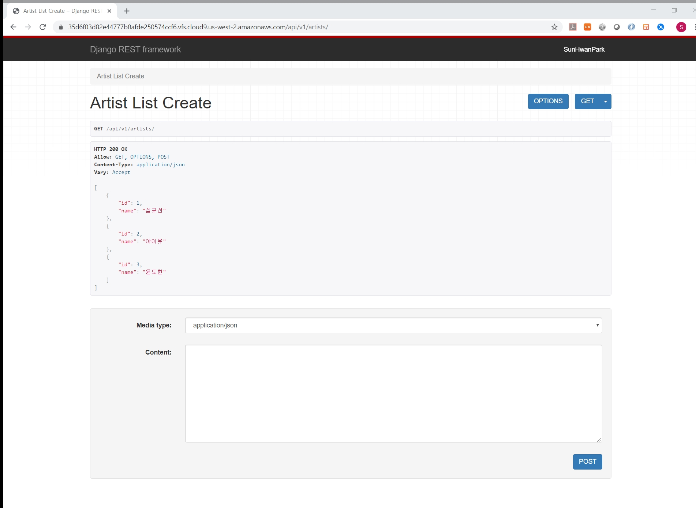
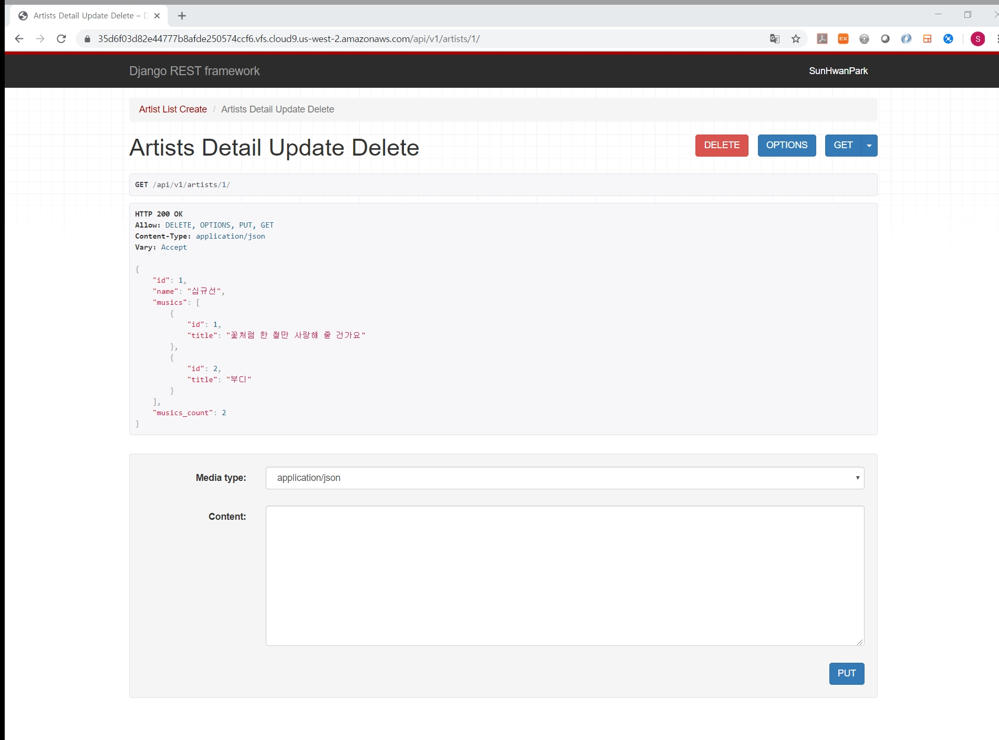
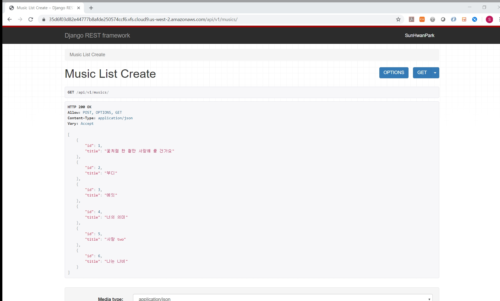
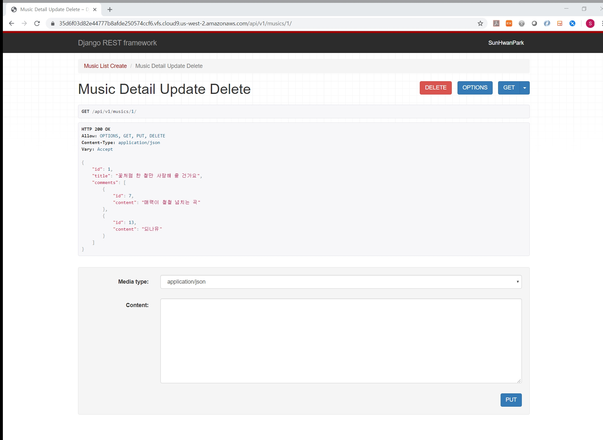
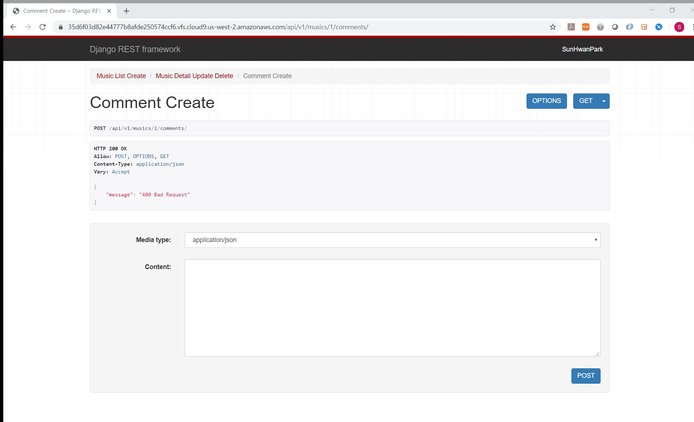
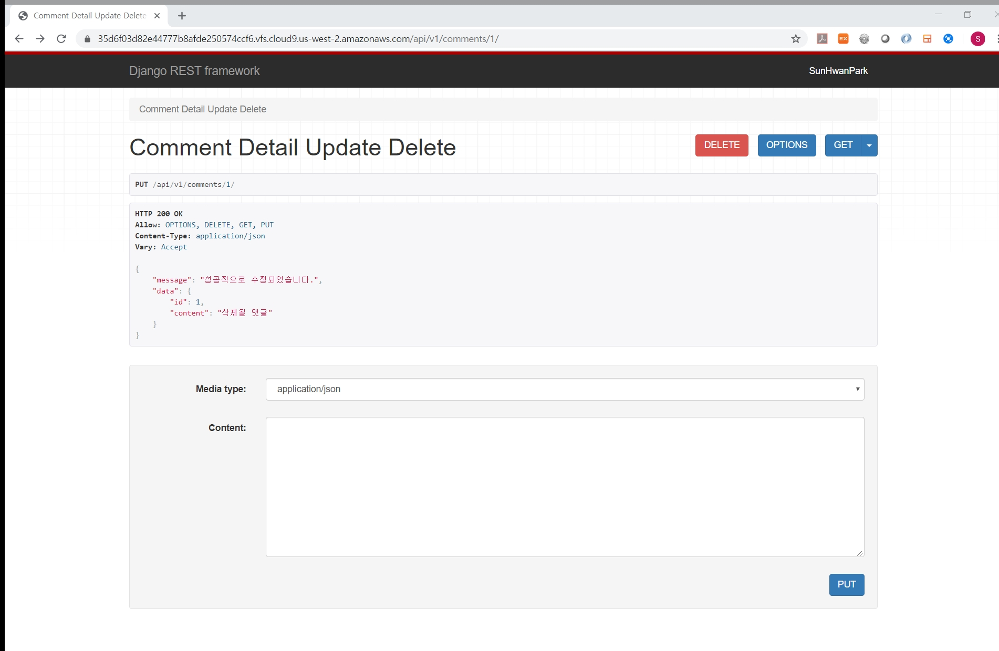
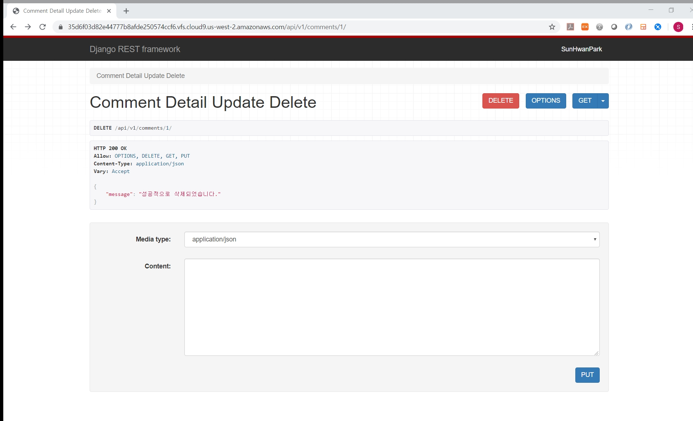

# 0511_workshop

## 결과 사진

- GET api/v1/artists/

  

- GET api/v1/artists/<artist_pk>/

  

- GET api/v1/musics/

  

- GET api/v1/musics/<music_pk>/

  

- POST api/v1/musics/<music_pk>/comments/ (success)

  

- POST api/v1/musics/<music_pk>/comments/ (error)

  

- PUT api/v1/comments/<comment_pk>/ (success)

  

- PUT api/v1/comments/<comment_pk>/ (error)

  

- DELETE api/v1/comments/<comment_pk>/ (success)

  

## Code

- views.py

  ```python
  from django.shortcuts import render, get_object_or_404
  from .models import Artist, Music, Comment
  from .serializers import CommentSerializer, CommentCreateSerializer, MusicSerializer, MusicDetailSerializer, ArtistSerializer, ArtistDetailSerializer
  
  from rest_framework.response import Response
  from rest_framework.decorators import api_view
  # Create your views here.
  
  @api_view(['GET', 'POST'])
  def artist_list_create(request):
      if request.method == 'POST':
          serializer = ArtistSerializer(data=request.data)
          if serializer.is_valid(raise_exception=True):
              serializer.save()
      else:
          artists = Artist.objects.all()
          serializer = ArtistSerializer(artists, many=True)
      return Response(serializer.data)
  
  @api_view(['GET', 'PUT', 'DELETE'])
  def artists_detail_update_delete(request, artist_pk):
      artist = get_object_or_404(Artist, pk=artist_pk)
      if request.method == 'PUT':
          serializer = ArtistDetailSerializer(data=request.data, instance=artist)
          if serializer.is_valid(raise_exception=True):
              serializer.save()
              return Response({"message": "성공적으로 수정되었습니다.", "data": serializer.data})
      elif request.method == 'DELETE':
          artist.delete()
          return Response({"message": "성공적으로 삭제되었습니다."})
      else:
          serializer = ArtistDetailSerializer(artist)
          return Response(serializer.data)
  
  @api_view(['GET', 'POST'])
  def music_list_create(request):
      if request.method == 'POST':
          serializer = MusicSerializer(data=request.data)
          if serializer.is_valid(raise_exception=True):
              serializer.save()
      else:
          musics = Music.objects.all()
          serializer = MusicSerializer(musics, many=True)
      return Response(serializer.data)
  
  @api_view(['GET', 'PUT', 'DELETE'])
  def music_detail_update_delete(request, music_pk):
      music = get_object_or_404(Music, pk=music_pk)
      if request.method == 'PUT':
          serializer = MusicDetailSerializer(data=request.data, instance=music)
          if serializer.is_valid(raise_exception=True):
              serializer.save()
              return Response({"message": "성공적으로 수정되었습니다.", "data": serializer.data})
      elif request.method == 'DELETE':
          music.delete()
          return Response({"message": "성공적으로 삭제되었습니다."})
      else:
          serializer = MusicDetailSerializer(music)
          return Response(serializer.data)
  
  @api_view(['GET', 'POST'])
  def comment_create(request, music_pk):
      request.data['music'] = music_pk
      serializer = CommentCreateSerializer(data=request.data)
      if serializer.is_valid():
          serializer.save()
          return Response(serializer.data)
      else:
          return Response({"message": "400 Bad Request"})
  
  @api_view(['GET', 'PUT', 'DELETE'])
  def comment_detail_update_delete(request, comment_pk):
      comment = get_object_or_404(Comment, pk=comment_pk)
      if request.method == 'PUT':
          serializer = CommentSerializer(data=request.data, instance=comment)
          if serializer.is_valid():
              serializer.save()
              return Response({"message": "성공적으로 수정되었습니다.", "data": serializer.data})
          else:
              return Response({"message": "400 Bad Request"})
      elif request.method == 'DELETE':
          comment.delete()
          return Response({"message": "성공적으로 삭제되었습니다."})
      else:
          serializer = CommentSerializer(comment)
          return Response(serializer.data)
  ```

- serializers.py

  ```python
  from rest_framework import serializers
  from .models import Artist, Music, Comment
  
  class CommentSerializer(serializers.ModelSerializer):
      class Meta:
          model = Comment
          fields = ['id', 'content']
  
  class CommentCreateSerializer(CommentSerializer):
      class Meta(CommentSerializer.Meta):
          fields = CommentSerializer.Meta.fields + ['music']
  
  class MusicSerializer(serializers.ModelSerializer):
      class Meta:
          model = Music
          fields = ['id', 'title']
  
  class MusicDetailSerializer(MusicSerializer):
      comment_set = CommentSerializer(many=True)
      comments = comment_set
      class Meta(MusicSerializer.Meta):
          fields = MusicSerializer.Meta.fields + ['comment_set', 'comments']
  
  class ArtistSerializer(serializers.ModelSerializer):
      class Meta:
          model = Artist
          fields = ['id', 'name']
  
  class ArtistDetailSerializer(ArtistSerializer):
      music_set = MusicSerializer(many=True)
      musics = music_set
      musics_count = serializers.IntegerField(
          source='music_set.count',
          read_only=True
          )
      class Meta(ArtistSerializer.Meta):
          fields = ArtistSerializer.Meta.fields + ['music_set', 'musics', 'musics_count']
  ```