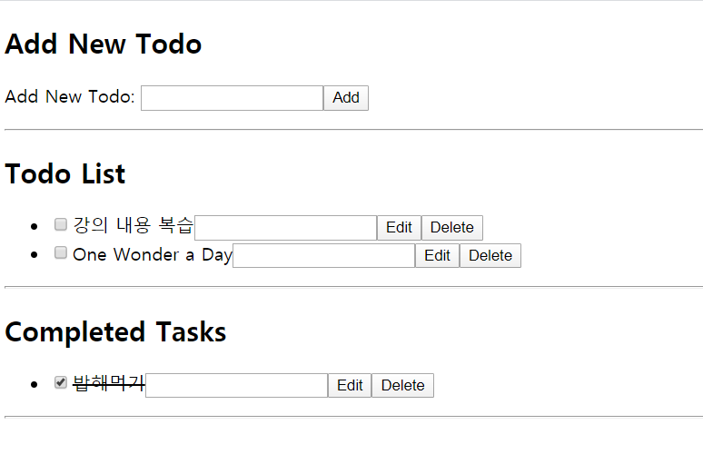

# 0518_workshop

## 결과 사진



## `todo_list.html`

```html
<!DOCTYPE html>
<html lang="ko">
<head>
  <meta charset="UTF-8">
  <meta name="viewport" content="width=device-width, initial-scale=1.0">
  <title>0518 exercise & workshop</title>
</head>
<body>
  <h2>Add New Todo</h2>
  <p id="addNewTodo"></p>
  <hr>

  <h2>Todo List</h2>
  <ul id="toDoList"></ul>
  <hr>

  <h2>Completed Tasks</h2>
  <ul id="completedTasks"></ul>
  <hr>

  <script>
    // 여기에 코드를 작성하시오.
    completedTasks = document.querySelector('#completedTasks')

    const createTodo = function(labelname) {
      const newInput = document.createElement('li')
      
      const checkBox = document.createElement('input')
      checkBox.type = 'checkbox'
      checkBox.addEventListener('click', function(event) {
        newInputLabel.innerHTML = '<del>' + newInputLabel.innerText + '</del>'
        completedTasks.appendChild(newInput)
      })

      const newInputLabel = document.createElement('label')
      newInputLabel.innerText = labelname

      const editInput = document.createElement('input')
      editInput.type = 'text'
      // 엔터키 누르면 바로 등록되게
      editInput.addEventListener('keypress', function(event){
        if (event.key === "Enter") {
          if (editInput.value) {
            newInputLabel.innerText = editInput.value
            editInput.value = null
          }
        }
      })

      const editButton = document.createElement('button')
      editButton.innerText = 'Edit'
      editButton.addEventListener('click', function(event) {
        if (editInput.value) {
          newInputLabel.innerText = editInput.value
          editInput.value = null
        }
      })

      const deleteButton = document.createElement('button')
      deleteButton.innerText = 'Delete'
      deleteButton.addEventListener('click', function(event) {
        newInput.remove()
      })

      newInput.append(checkBox, newInputLabel, editInput, editButton, deleteButton)

      return newInput
    }

    
    newTodo = document.querySelector('#addNewTodo')
    
    const newTodoLabel = document.createElement('label')
    newTodoLabel.innerText = 'Add New Todo: '

    const newTodoInput = document.createElement('input')
    // 상용 어트리뷰트
    // newTodoInput.type = 'text'

    // 사용자 정의 어트리뷰트
    // newTodoinput.setAttribute('required', 'true')
    // newTodoInput.required

    newTodoInput.setAttribute('type', 'text')
    // 엔터키 누르면 바로 등록되게
    newTodoInput.addEventListener('keypress', function(event) {
      if (event.key === "Enter") {
        if (newTodoInput.value) { // input 값이 있는 경우에만
          toDoList.appendChild(createTodo(newTodoInput.value)) // newInput 객체
          newTodoInput.value = null
        }
      }
    })

    const newTodoButton = document.createElement('button')
    newTodoButton.innerText = 'Add'
    newTodoButton.addEventListener('click', function(event) {
      // toDoList.appendChild(newTodoInput.value) => error, 인자로 Node 객체만 받음
      // toDoList.append('<li>' + newTodoInput.value + '<li>') // => 동작함. string도 처리 가능. innerText와 비슷한 느낌
      // const newInput = document.createElement('li')
      
      if (newTodoInput.value) { // input 값이 있는 경우에만
        toDoList.appendChild(createTodo(newTodoInput.value)) // newInput 객체
        newTodoInput.value = null
      }
    })

    newTodo.append(newTodoLabel, newTodoInput, newTodoButton)
  </script>
</body>
</html>
```

