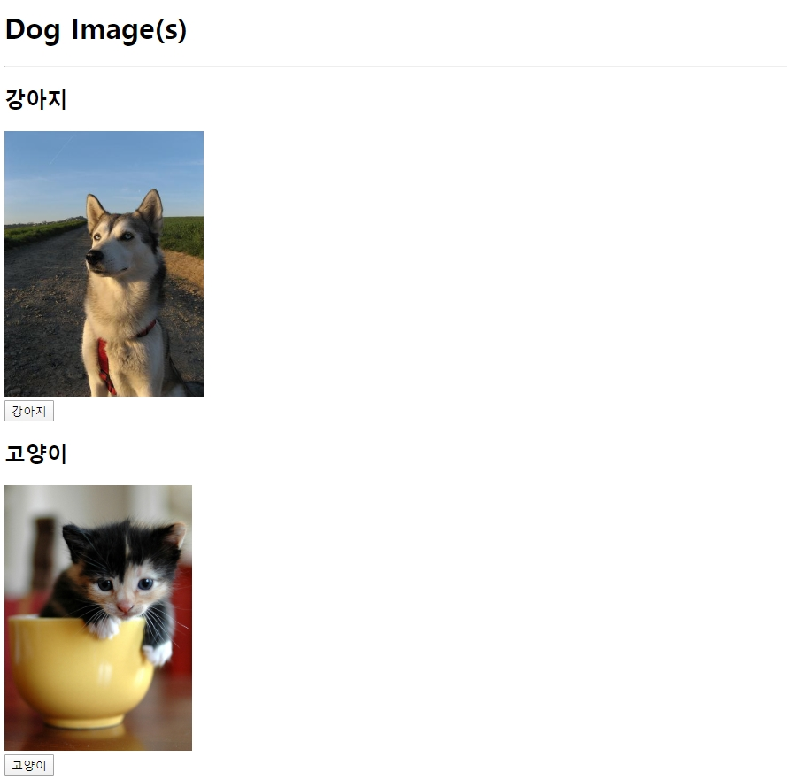

# 0519_exercise

## 결과 사진



## get_dog_image.html

```html
<!DOCTYPE html>
<html lang="ko">
<head>
  <meta charset="UTF-8">
  <meta name="viewport" content="width=device-width, initial-scale=1.0">
  <meta http-equiv="X-UA-Compatible" content="ie=edge">
  <title>exercise</title>
</head>
<body>
  <h1>Dog Image(s)</h1>
  <hr>

  <h2>강아지</h2>
  <div class="dogs"></div>
  <button id="dog">강아지</button>

  <h2>고양이</h2>
  <div class="cats"></div>
  <button id="cat">고양이</button>

  <script src="https://cdn.jsdelivr.net/npm/axios/dist/axios.min.js"></script>
  <script>
    // 여기에 코드를 작성하시오.    
    const addDogImage = function() {
      const dogURL = 'https://dog.ceo/api/breeds/image/random'
      axios.get(dogURL).then(
        response => {
          const imgURL = response.data.message
          const dogImage = document.createElement('img')
          dogImage.src = imgURL
          dogImage.style.height = '300px'
          document.querySelector('.dogs').appendChild(dogImage)
        } 
      )
    }

    const addCatImage = function() {
      const catURL = 'https://api.thecatapi.com/v1/images/search'
      axios.get(catURL).then(
        response => {
          const imgURL = response.data[0].url
          const catImage = document.createElement('img')
          catImage.src = imgURL
          catImage.style.height = '300px'
          document.querySelector('.cats').appendChild(catImage)
        } 
      )
    }

    const dogButton = document.querySelector('#dog')
    dogButton.addEventListener('click', addDogImage)
    
    const catButton = document.querySelector('#cat')
    catButton.addEventListener('click', addCatImage)
  </script>
</body>
</html>
```