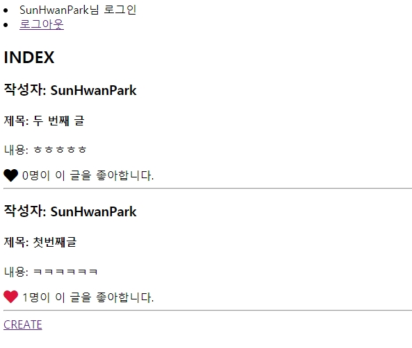

# 0519_workshop

## 결과 사진



## Code

- index.html

  ```html
  
  
  
    <h2>INDEX</h2>
    
      <h3>작성자: {{ article.user }}</h3>
      <h4>제목: {{ article.title }}</h4>
      <p>내용: {{ article.content }}</p>
      
        <i class="fas fa-heart fa-lg like-buttons" style="color:crimson" data-id="{{ article.pk }}"></i>
      
        <i class="fas fa-heart fa-lg like-buttons" style="color:black" data-id="{{ article.pk }}"></i>
      
      <span id="like-count-{{ article.pk }}">{{ article.like_users.all|length }}</span>명이 이 글을 좋아합니다.
      <hr>
    
    <a href="">CREATE</a>
    <script>
      const likeButtonList = document.querySelectorAll('.like-buttons')
      likeButtonList.forEach(likeButton => {
        likeButton.addEventListener('click', e => {
          const articleID = e.target.dataset.id
          
          axios.get(`/articles/${articleID}/like_api/`)
            .then(res => {
              if (res.data.liked) {
                e.target.style.color = 'crimson'
              } else {
                e.target.style.color = 'black'
              }
              document.querySelector(`#like-count-${articleID}`).innerText = res.data.count
            })
          
            alert('비로그인 사용자는 좋아요를 누를 수 없습니다.')
          
        })
      }) 
    </script>
  
  ```

- views.py

  ```python
  from django.shortcuts import render, redirect, get_object_or_404
  from .models import Article
  from .forms import ArticleForm
  from django.http import JsonResponse
  from django.contrib.auth.decorators import login_required
  
  def index(request):
      articles = Article.objects.order_by('-pk')
      context = {
          'articles': articles,
      }
      return render(request, 'articles/index.html', context)
  
  @login_required
  def create(request):
      if request.method == 'POST':
          form = ArticleForm(request.POST)
          if form.is_valid():
              article = form.save(commit=False)
              article.user = request.user
              article.save()
              return redirect('articles:index')
      else:
          form = ArticleForm()
      context = {
          'form': form,
      }
      return render(request, 'articles/form.html', context)
  
  @login_required
  def like_api(request, article_pk):
      user = request.user 
      article = get_object_or_404(Article, pk=article_pk)
      
      if article.like_users.filter(pk=user.pk).exists():
          article.like_users.remove(user)
          liked = False
      else:
          article.like_users.add(user)
          liked = True
  
      context = {
          'liked': liked,
          'count': article.like_users.count()
      }
      return JsonResponse(context)
  ```

