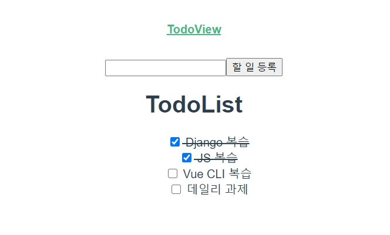

# 0601_exercise



- `App.vue`

  ```vue
  <template>
    <div id="app">
      <div id="nav">
        <router-link to="/">TodoView</router-link>
      </div>
      <router-view/>
    </div>
  </template>
  
  <style>
  #app {
    font-family: Avenir, Helvetica, Arial, sans-serif;
    -webkit-font-smoothing: antialiased;
    -moz-osx-font-smoothing: grayscale;
    text-align: center;
    color: #2c3e50;
  }
  
  #nav {
    padding: 30px;
  }
  
  #nav a {
    font-weight: bold;
    color: #2c3e50;
  }
  
  #nav a.router-link-exact-active {
    color: #42b983;
  }
  </style>
  ```

- `views/TodoView.vue`

  ```vue
  <template>
    <div>
      <TodoInput @create="createTodo" />
      <TodoList :todos="todos" @checked="updateTodo" />
    </div>
  </template>
  
  <script>
  import TodoList from '../components/TodoList.vue'
  import TodoInput from '../components/TodoInput.vue'
  
  export default {
    name: 'TodoView',
    components: {
        TodoList,
        TodoInput
    },
    data() {
      return {
        todos: [
          { id: 1, content: 'Django 복습', isCompleted: true },
          { id: 2, content: 'JS 복습', isCompleted: false },
          { id: 3, content: 'Vue CLI 복습', isCompleted: false }
        ]
      }
    },
    methods: {
      updateTodo(todo) {
        todo.isCompleted = !todo.isCompleted
      },
      createTodo(todo) {
        this.todos.push(todo)
      }
    }
  }
  </script>
  
  <style>
  
  </style>
  ```

- `router/index.js`

  ```js
  import Vue from 'vue'
  import VueRouter from 'vue-router'
  import TodoView from '../views/TodoView.vue'
  
  Vue.use(VueRouter)
  
    const routes = [
    {
      path: '/',
      name: 'TodoView',
      component: TodoView
    }
  ]
  
  const router = new VueRouter({
    mode: 'history',
    base: process.env.BASE_URL,
    routes
  })
  
  export default router
  ```

- `components/TodoList.vue`

  ```vue
  <template>
    <div>
      <h1>TodoList</h1>
      <ul>
        <!-- 목록을 보여줄 예정 -->
        <li class="todo-list" v-for="todo in todos" :key="todo.id" :class="{ completed: todo.isCompleted }">
          <input type="checkbox" :checked="todo.isCompleted" @click="$emit('checked', todo)">
          {{ todo.content }}
        </li>
      </ul>
    </div>
  </template>
  
  <script>
  export default {
    name: 'TodoList',
    props: {
      todos: {
        type: Array,
        required: true
      }
    }
  }
  </script>
  
  <style>
    .completed {
      text-decoration: line-through;
    }
  
    .todo-list {
      text-align: center;
      list-style-type: none;
    }
  </style>
  ```

- `components/TodoInput.vue`

  ```vue
  <template>
    <div>
      <input type="text" v-model="newTodo" @keypress.enter="writeTodo">
      <button @click="writeTodo">할 일 등록</button>
    </div>
  </template>
  
  <script>
  export default {
    name: 'TodoInput',
    data() {
      return {
        newTodo: ''
      }
    },
    methods: {
      writeTodo() {
        if (this.newTodo.trim()) {
          this.$emit('create', {
            id: Date.now(),
            content: this.newTodo,
            isCompleted: false
          })
          this.newTodo = ''
        }
      }
    }
  }
  </script>
  
  <style>
  
  </style>
  ```