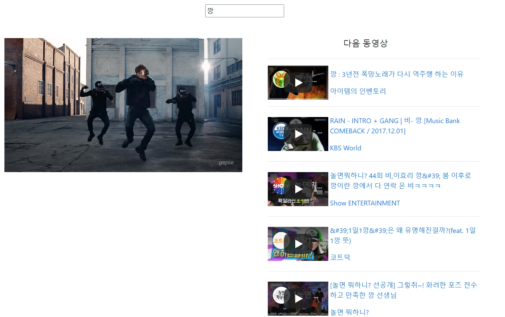

# 0601_workshop



- `App.vue`

  ```vue
  <template>
    <div class="container d-flex flex-column align-items-center">
      <SearchBar class="m-3" @input-change="onInputChange" />
      <hr>
      <div class="row">
        <firstVideo class="col-6" :firstVideo="firstVideo" />
        <VideoList class="col-6" :videos="videos" />
      </div>
    </div>
  </template>
  
  <script>
  import axios from 'axios'
  import SearchBar from './components/SearchBar.vue'
  import VideoList from './components/VideoList.vue'
  import firstVideo from './components/firstVideo.vue'
  
  const API_KEY = process.env.VUE_APP_YOUTUBE_API_KEY
  const API_URL = 'https://www.googleapis.com/youtube/v3/search'
  
  export default {
    name: 'App',
    components: {
      SearchBar,
      VideoList,
      firstVideo
    },
    data() {
      return {
        inputValue: '',
        firstVideo: '',
        videos: []
      }
    },
    methods: {
      onInputChange(inputText) {
        this.inputValue = inputText
        axios.get(API_URL, {
          params: {
            key: API_KEY,
            part: 'snippet',
            type: 'video',
            q: this.inputValue,
            maxResults: 10
          }
        })
          .then(res => {
            this.videos = res.data.items
            this.firstVideo = this.videos.shift()
          })
          .catch(err => console.error(err))
      }
    }
  }
  </script>
  ```

- `components/firstVideo.vue`

  ```vue
  <template>
    <div class="d-flex flex-column align-items-center">
      <iframe width="560" height="315" :src="'https://www.youtube.com/embed/' + firstVideo.id.videoId +'?autoplay=1&mute=1'" frameborder="0" allow="accelerometer; autoplay; encrypted-media; gyroscope; picture-in-picture" allowfullscreen></iframe>
    </div>
  </template>
  
  <script>
  export default {
    name: 'firstVideo',
    props: {
      firstVideo: Object
    }
  }
  </script>
  
  <style>
  
  </style>
  ```

- `components/videoList.vue`

  ```vue
  <template>
    <div class="d-flex flex-column align-items-center">
      <h5>다음 동영상</h5>
      <ul>
        <li class="video-list" v-for="video in videos" :key="video.etag">
          <hr>
          <div class="d-flex align-items-center">
            <iframe width="142" height="80" :src="'https://www.youtube.com/embed/' + video.id.videoId" frameborder="0" allow="accelerometer; autoplay; encrypted-media; gyroscope; picture-in-picture" allowfullscreen></iframe>
            <div class="m-1">
              <p class="mb-3"><a :href="'https://www.youtube.com/watch?v=' + video.id.videoId">{{ video.snippet.title }}</a></p>
              <p class="mb-0"><a :href="'https://www.youtube.com/channel/' + video.snippet.channelId">{{ video.snippet.channelTitle }}</a></p>
            </div>
          </div>
        </li>
      </ul>
    </div>
  </template>
  
  <script>
  export default {
    name: 'VideoList',
    props: {
      videos: Array
    }
  }
  </script>
  
  <style>
    .video-list {
      list-style-type: none;
    }
  </style>
  ```

- `components/SearchBar.vue`

  ```vue
  <template>
    <div>
      <input @keypress.enter="onInput" placeholder="검색어를 입력하세요">
    </div>
  </template>
  
  <script>
  
  export default {
    name: 'SearchBar',
    methods: {
      onInput(event) {
        this.$emit('input-change', event.target.value)
      }
    }
  }
  </script>
  
  <style>
  
  </style>
  ```