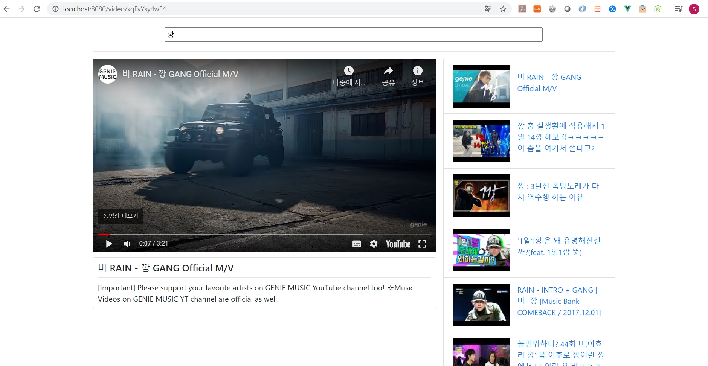

# 0602_workshop



- `App.vue`

  ```vue
  <template>
    <div class="container">
      <SearchBar @input-change="onInputChange" />
      <hr>
      <div v-if="selectedVideo">
        <div class="row">
          <router-view :video="selectedVideo" />
          <VideoDetail v-if="this.$route.path==='/'" :video="selectedVideo" />
          <VideoList @video-select="onVideoSelect" :videos="videos" />
        </div>
      </div>
      <div v-else>
        <router-view/>
      </div>
    </div>
  </template>
  
  <script>
  import axios from 'axios'
  import SearchBar from './components/SearchBar.vue'
  import VideoList from './components/VideoList.vue'
  import VideoDetail from './components/VideoDetail.vue'
  
  /*
    .env.local 파일에 작성한 변수명이
    서버 최초 실행시에 process.env.변수명으로 자동 설정된다.
    **단**, 변수명의 접두사가 VUE_APP_ 이어야 한다.
  */
  const API_KEY = process.env.VUE_APP_YOUTUBE_API_KEY
  const API_URL = 'https://www.googleapis.com/youtube/v3/search'
  
  export default {
    name: 'App',
    components: {
      SearchBar,
      VideoList,
      VideoDetail
    },
    data() {
      return {
        inputValue: '',
        videos: [],
        selectedVideo: null
      }
    },
    methods: {
      onInputChange(inputText) {
        this.inputValue = inputText
        axios.get(API_URL, {
          params: {
            key: API_KEY,
            part: 'snippet',
            type: 'video',
            q: this.inputValue,
            maxResults: 10
          }
        })
          .then(res => {
            res.data.items.forEach(item => {
              const parser = new DOMParser()
              const doc = parser.parseFromString(item.snippet.title, 'text/html')
              item.snippet.title = doc.body.innerText
            })
            this.videos = res.data.items
            this.selectedVideo = this.videos[0]
          })
          .catch(err => console.error(err))
      },
      onVideoSelect(video) {
        this.selectedVideo = video
      }
    }
  }
  </script>
  ```

- `router/indes.js`

  ```js
  import Vue from 'vue'
  import VueRouter from 'vue-router'
  import VideoDetail from '../components/VideoDetail.vue'
  
  Vue.use(VueRouter)
    const routes = [
    {
      path: '/video/:videoId',
      name: 'videoPage',
      component: VideoDetail
    }
  ]
  
  const router = new VueRouter({
    mode: 'history',
    base: process.env.BASE_URL,
    routes
  })
  
  export default router
  ```

- `components/SearchBar.vue`

  ```vue
  <template>
    <div class="search-bar">
      <input @keypress.enter="onInput" placeholder="검색어를 입력하세요 :)">
    </div>
  </template>
  
  <script>
  
  export default {
    name: 'SearchBar',
    methods: {
      onInput(event) {
        this.$emit('input-change', event.target.value)
      }
    }
  }
  </script>
  
  <style scoped>
  /* 
      scoped 옵션은 해당 컴포넌트에만 영향을 준다.
      하지만, class 지정은 해야한다. 왜냐하면 그게 더 빠르기 때문.
  */
    div.search-bar {
      text-align: center;
      margin: 20px;
    }
    div.search-bar > input {
      width: 75%; 
    }
  </style>
  ```

- `components/VideoList.vue`

  ```vue
  <template>
    <ul class="list-group col-lg-4">
      <VideoListItem v-for="video in videos" :key="video.etag" :video="video" @video-select="onVideoSelect" />
    </ul>
  </template>
  
  <script>
  import VideoListItem from './VideoListItem.vue'
  
  export default {
    name: 'VideoList',
    components: {
      VideoListItem
    },
    props: {
      videos: Array,
    },
    methods: {
      onVideoSelect(video) {
        this.$emit('video-select', video)
      }
    }
  }
  </script>
  
  <style>
    .video-list {
      list-style-type: none;
    }
  </style>
  ```

- `components/VideoListItem.vue`

  ```vue
  <template>
    <router-link :to="{ name: 'videoPage', params: { videoId: videoIdReturn }}">
      <li @click="onVideoSelect" class="video-list-item list-group-item">
        
        <div class="media-body">
          <p>{{ video.snippet.title }}</p>
        </div>
      </li>
    </router-link>
  </template>
  
  <script>
  export default {
    name: 'VideoListItem',
    props: {
      video: Object
    },
    methods: {
      onVideoSelect() {
        this.$emit('video-select', this.video)
      }
    },
    computed: {
      // 함수지만 명사 => 결국 리턴되는 값으로 사용되기 때문
      thumbnailUrl() {
        return this.video.snippet.thumbnails.default.url
      },
      videoIdReturn() {
        return this.video.id.videoId
      }
    }
  }
  </script>
  
  <style scoped>
    li.video-list-item {
      display: flex;
      cursor: pointer;
    }
  
    li.video-list-item:hover {
      background-color: #eee;
    }
  
    .media-body {
      margin: auto 0;
    }
  </style>
  ```

- `components/VideoDetail.vue`

  ```vue
  <template>
    <div v-if="video" class="col-lg-8 mb-5">
      <div class="embed-responsive embed-responsive-16by9">
        <iframe
          class="embed-responsive-item"
          :src="videoUrl"
          allowfullscreen></iframe>
      </div>
      <div class="details">
        <h5 class="mb-0">{{ video.snippet.title }}</h5>
        <hr class="my-2">
        <p class="mb-0">{{ video.snippet.description }}</p>
      </div>
    </div>
  
    <div v-else>
      <div class="embed-responsive embed-responsive-16by9">
        <iframe
          class="embed-responsive-item"
          :src="videoUrl2"
          allowfullscreen></iframe>
      </div>
    </div>
  </template>
  
  <script>
  export default {
    name: 'VideoDetail',
    data: function() {
      return {
        pageVideoId: this.$route.params.videoId
      }
    },
    props: {
      video: Object
    },
    computed: {
      videoUrl() {
        return `https://www.youtube.com/embed/${this.video.id.videoId}?autoplay=1&mute=1`
      },
      videoUrl2() {
        return `https://www.youtube.com/embed/${this.pageVideoId}?autoplay=1&mute=1`
      }
    }
  }
  </script>
  
  <style>
    div.details {
      margin-top: 10px;
      padding: 10px;
      border: 1px solid #ddd;
      border-radius: 4px;
    }
  </style>
  ```

  

